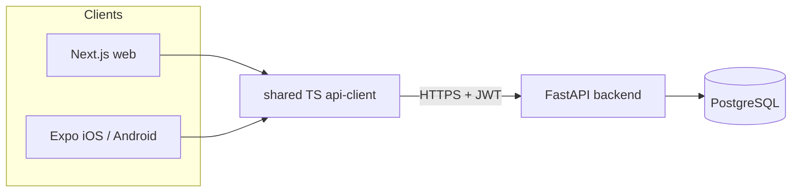

# Ledger

Personal finance platform: live bank sync, transaction categorization that never shows a vague
merchant, rich visualizations, and an AI budget planner. iOS + Android + web on one backend.

**Status:** early development. Auth, users, and households are working end to end; bank sync is
next.

## What works today

- Email/password registration and login with argon2id hashing
- Short-lived access tokens (15 min) + rotating refresh tokens with server-side sessions,
  logout, and logout-all-devices
- TOTP two-factor auth: enroll, activate, and challenge on login
- Households with owner/member roles; a personal household is created on signup
- Web app (Next.js): register, sign in (incl. MFA challenge), dashboard shell
- Mobile app (Expo): sign-in flow with refresh tokens in the platform keychain
- Shared TypeScript API client used by both frontends

## Architecture



The backend is a modular monolith (domain packages: `auth`, `users`, `households`, with
`connections`, `transactions`, `enrichment`, `budgets`, `planner` planned). Details and ERD in
[docs/architecture.md](docs/architecture.md); decisions in [docs/adr/](docs/adr/).

## Run it

Backend + database:

```bash
docker compose up --build
# API on http://localhost:8000, docs at /docs
```

Or natively:

```bash
cd backend
python -m venv .venv && .venv/Scripts/activate  # or source .venv/bin/activate
pip install -r requirements.txt
alembic upgrade head   # needs LEDGER_DATABASE_URL pointing at Postgres
uvicorn app.main:app --reload
```

Web:

```bash
npm install --workspace packages/api-client --workspace apps/web
npm run dev --workspace apps/web
# http://localhost:3000
```

Tests:

```bash
cd backend
python -m pytest -q
```

## Docs

- [Architecture + ERD](docs/architecture.md)
- [ADRs](docs/adr/)
- [Market research](docs/market-research.md)

## Roadmap

1. ~~Auth, users, households~~ (done)
2. Plaid Link + transaction sync
3. Categorization pipeline (aggregator data -> enrichment API -> rules -> embeddings -> LLM ->
   user feedback loop)
4. Budgets and core visualizations (net worth, cash flow, category trends, Sankey)
5. AI assistant with tool-calling
6. AI budget planner with goal re-forecasting and scenario modeling
