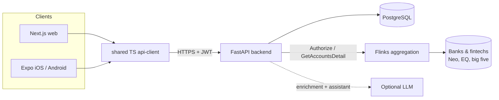

# Ledger

Personal finance platform for Canada: live bank sync (including fintechs like Neo Financial and
EQ Bank via Flinks), transaction categorization that never shows a vague merchant, rich
visualizations, and an AI budget planner. iOS + Android + web on one backend.

**Status:** MVP feature set in place through planner and assistant. Optional LLM key unlocks
richer narration; everything else runs offline against Flinks sandbox + rule/embedding cascade.

## What works today

- Email/password registration and login with argon2id hashing
- Short-lived access tokens (15 min) + rotating refresh tokens with server-side sessions,
  logout, and logout-all-devices
- TOTP two-factor auth: enroll, activate, and challenge on login
- Households with owner/member roles; invite an existing user by email; personal household on signup
- Bank connections via the Flinks Connect widget (Neo, EQ, big five, etc.); pull sync +
  `POST /v1/ops/sync-all` for batch refresh
- Categorization cascade: normalize -> user rules -> global rules -> token/embedding match ->
  optional LLM -> needs-review. Corrections teach the household permanently
- Budgets (flexible / zero-based) with propose-from-history and target vs actual
- Metrics: net worth, cash flow, spending by category/merchant, Sankey payload
- Goals + deterministic AI planner (monthly needed, cuts, scenario modeling - math never from LLM)
- AI assistant with tool-calling (works offline from live tools; Anthropic when `LEDGER_LLM_API_KEY` set)
- Notifications for sync events
- Web: dashboard, connect, transactions, insights, budgets, goals, assistant
- Mobile: Expo sign-in shell; Shared TypeScript API client

## Architecture



Domains: `auth`, `users`, `households`, `connections`, `enrichment`, `budgets`, `metrics`,
`planner`, `assistant`, `notifications`. See [docs/architecture.md](docs/architecture.md) and
[docs/adr/](docs/adr/).

## Run it

```bash
docker compose up --build
# API http://localhost:8000  docs /docs
```

```bash
npm install --workspace packages/api-client --workspace apps/web
npm run dev --workspace apps/web
# http://localhost:3000
```

Optional: set `LEDGER_LLM_API_KEY` (Anthropic) for LLM enrichment and richer assistant replies.
Flinks sandbox needs no keys; for a real instance set `LEDGER_FLINKS_*` and
`NEXT_PUBLIC_FLINKS_IFRAME_URL`.

```bash
cd backend && python -m pytest -q
```

## Roadmap

1. ~~Auth, users, households~~
2. ~~Flinks bank sync~~
3. ~~Rules + correction feedback loop~~
4. ~~Embedding / soft-match + optional LLM enrichment~~
5. ~~Budgets + metrics visualizations~~
6. ~~AI assistant (tool-calling)~~
7. ~~AI planner + scenarios~~
8. ~~Batch sync + notifications + household invite~~
9. Polish: MFA recovery codes, real embedding API, scheduled cron, mobile feature parity,
   SOC 2 hardening docs
