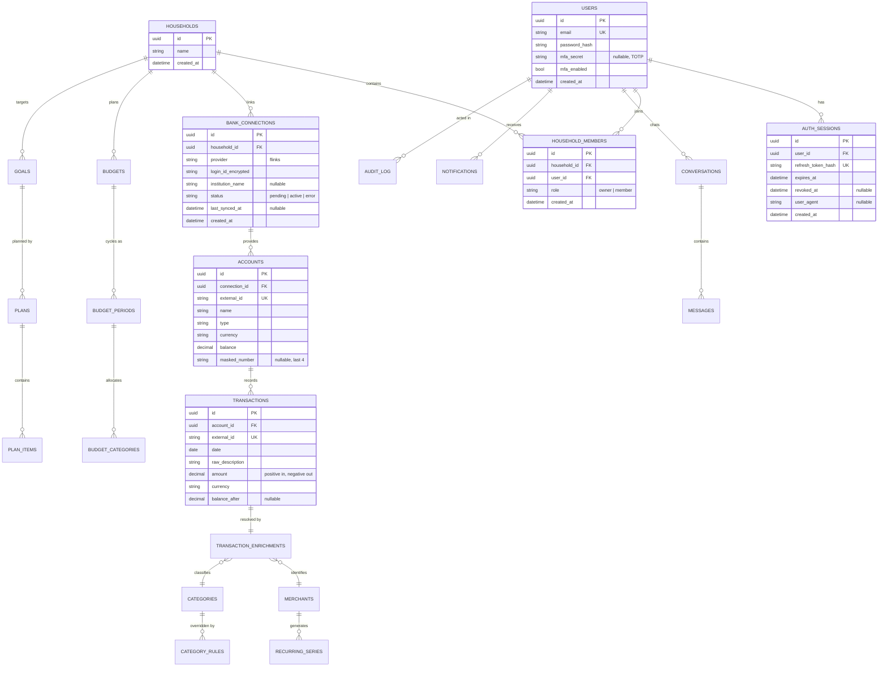

# Architecture

Woney is a personal-finance platform: iOS + Android apps, a full web app, and a
Python backend that syncs bank data, enriches transactions, and drives an AI assistant and budget
planner.

## Monorepo layout

```
ai-enabled-budget-er/
  apps/
    web/            Next.js app (full product, not a marketing page)
    mobile/         Expo React Native app (iOS + Android)
  packages/
    api-client/     shared TypeScript API client used by web and mobile
  backend/
    app/
      core/         config, database, security primitives, shared dependencies
      auth/         registration, login, tokens, MFA
      users/        user profile endpoints
      households/   household + membership endpoints
      connections/  Flinks provider, bank connections, accounts, transactions
      enrichment/   categorization cascade: normalizer, rules, corrections
    alembic/        migrations
    tests/
  docs/
    adr/            architecture decision records
    architecture.md
    deploy.md       production hosting runbook (Render/Fly + Vercel + EAS)
    market-research.md
  docker-compose.yml
  render.yaml       Render Blueprint (API + Postgres)
  fly.toml          Fly.io alternative for API
  vercel.json       Vercel install/build for web workspace
  .github/workflows/ci.yml
```

The backend is a modular monolith: one deployable, organized by domain so a domain can be split
into its own service later without a rewrite. Domains shipped: `auth`, `users`, `households`,
`connections`, `enrichment`, `budgets`, `metrics`, `planner`, `assistant`, `notifications`.
## Entity-relationship diagram

Tables through slice 2 exist with full column detail below; the remaining entities are planned
and shown for direction.



Built tables: `users`, `auth_sessions`, `households`, `household_members` (slice 1);
`bank_connections`, `accounts`, `transactions` (slice 2); `categories`, `merchants`,
`transaction_enrichments`, `category_rules` (slice 3). Registering a user creates a personal
household with an `owner` membership; shared households and invitations come with the
household-sharing slice.

## Categorization cascade

Every synced transaction gets a `transaction_enrichments` row recording which stage resolved
it and at what confidence: per-household **user rules** (exact match on the normalized
descriptor, created from corrections) -> **global rules** (regex table of Canadian merchants
and bank patterns) -> **unresolved** (`needs_review`, surfaced in the UI for a one-tap fix).
Corrections upsert a durable household rule and re-apply to matching history, so the same
descriptor is never miscategorized twice. Raw descriptors never render in the UI - unresolved
rows fall back to a prettified name. Details in [ADR 0006](adr/0006-enrichment-cascade.md).

## Bank sync flow (Flinks)

1. Web/mobile embeds the Flinks Connect iframe; the user picks their institution (Neo, EQ,
   big-five, etc.), logs in, and consents.
2. The widget's `REDIRECT` postMessage event delivers a `loginId`; the client POSTs it to
   `/v1/connections/`.
3. The backend encrypts and stores the `loginId`, exchanges it for a `requestId` via
   `/Authorize`, then pulls accounts + up to 365 days of transactions with `/GetAccountsDetail`
   (polling the async variant on 202).
4. Accounts and transactions upsert idempotently on `external_id`; `POST
   /v1/connections/{id}/sync` re-pulls on demand. Debits/credits normalize to signed amounts.

See [ADR 0005](adr/0005-flinks-over-plaid.md) for why Flinks over Plaid.

## Auth flow

- Register with email + password (argon2id hash).
- Login returns a short-lived JWT access token (15 min) and an opaque refresh token. Refresh
  tokens are stored server-side as SHA-256 hashes in `auth_sessions` and rotate on every use.
- If MFA is enabled, login instead returns a 5-minute MFA challenge token; the client exchanges
  it plus a TOTP code for the real token pair.
- Logout revokes the presented session; logout-all revokes every session for the user.

See [ADR 0003](adr/0003-token-strategy.md) and [ADR 0004](adr/0004-mfa.md).

## Planned ADRs

Written now:

- 0001 - monorepo and platform stack
- 0002 - modular monolith backend
- 0003 - access/refresh token strategy
- 0004 - MFA: TOTP first, passkeys next
- 0005 - Flinks over Plaid for bank aggregation
- 0006 - enrichment cascade design

Expected as the build progresses:
- Embedding store and model choice for merchant matching (slice 4)
- Chart DSL for assistant-embedded visualizations (slice 6)
- Deterministic projection engine for the planner (slice 7)
