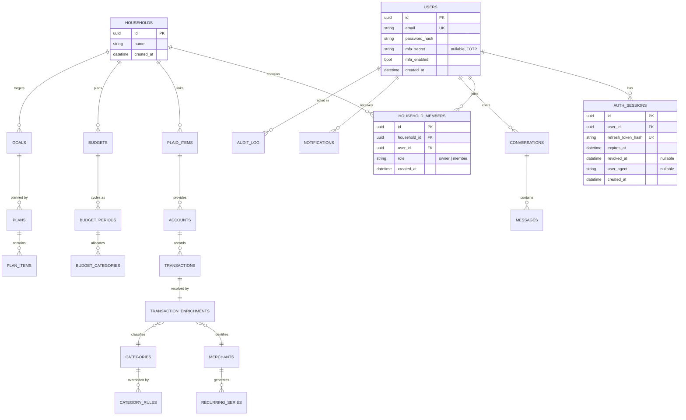

# Architecture

Ledger (working name) is a personal-finance platform: iOS + Android apps, a full web app, and a
Python backend that syncs bank data, enriches transactions, and drives an AI assistant and budget
planner.

## Monorepo layout

```
ai-enabled-budget-er/
  apps/
    web/            Next.js app (full product, not a marketing page)
    mobile/         Expo React Native app (iOS + Android)
  packages/
    api-client/     shared TypeScript API client used by web and mobile
  backend/
    app/
      core/         config, database, security primitives, shared dependencies
      auth/         registration, login, tokens, MFA
      users/        user profile endpoints
      households/   household + membership endpoints
    alembic/        migrations
    tests/
  docs/
    adr/            architecture decision records
    architecture.md
    market-research.md
  docker-compose.yml
  .github/workflows/ci.yml
```

The backend is a modular monolith: one deployable, organized by domain so a domain can be split
into its own service later without a rewrite. Future domains (slices 2+): `connections` (Plaid),
`transactions`, `enrichment`, `budgets`, `goals`, `planner`, `assistant`, `notifications`.

## Entity-relationship diagram

Entities in **bold** exist as of slice 1; the rest are planned and shown for direction.



Slice-1 tables: `users`, `auth_sessions`, `households`, `household_members`. Registering a user
creates a personal household with an `owner` membership; shared households and invitations come
with the household-sharing slice.

## Auth flow

- Register with email + password (argon2id hash).
- Login returns a short-lived JWT access token (15 min) and an opaque refresh token. Refresh
  tokens are stored server-side as SHA-256 hashes in `auth_sessions` and rotate on every use.
- If MFA is enabled, login instead returns a 5-minute MFA challenge token; the client exchanges
  it plus a TOTP code for the real token pair.
- Logout revokes the presented session; logout-all revokes every session for the user.

See [ADR 0003](adr/0003-token-strategy.md) and [ADR 0004](adr/0004-mfa.md).

## Planned ADRs

Written now:

- 0001 - monorepo and platform stack
- 0002 - modular monolith backend
- 0003 - access/refresh token strategy
- 0004 - MFA: TOTP first, passkeys next

Expected as the build progresses:

- Plaid behind a provider interface (slice 2)
- Enrichment cascade stage ordering and confidence thresholds (slices 3-4)
- Embedding store and model choice for merchant matching (slice 4)
- Chart DSL for assistant-embedded visualizations (slice 6)
- Deterministic projection engine for the planner (slice 7)
